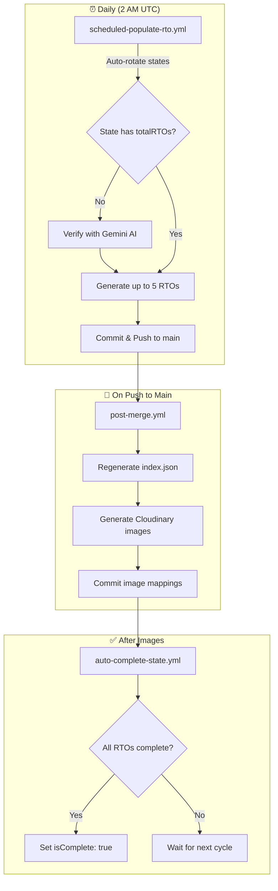

# RTO Codes Automation

This document describes the automated workflows that maintain and expand the RTO database.

## Overview

The automation system runs daily to populate RTO data across all Indian states, generate images, and track completion progress. **No manual intervention required** - the system pushes directly to main.



## Workflows

| Workflow                     | Trigger          | Purpose                               |
| ---------------------------- | ---------------- | ------------------------------------- |
| `scheduled-populate-rto.yml` | Daily 2 AM UTC   | Generate RTO data for rotating states |
| `post-merge.yml`             | Push to main     | Generate images, update indexes       |
| `auto-complete-state.yml`    | After post-merge | Mark states as complete               |
| `validate-pr.yml`            | PR opened        | Validate community contributions      |
| `enrich-pr.yml`              | Manual           | Enrich specific RTOs with AI          |

## Environment Variables Required

```bash
# Required for automation
GEMINI_API_KEY=           # Google Gemini AI for data generation
CLOUDINARY_CLOUD_NAME=    # Cloudinary cloud name
CLOUDINARY_API_KEY=       # Cloudinary API key
CLOUDINARY_API_SECRET=    # Cloudinary API secret
```

## State Rotation

The scheduled workflow automatically rotates through incomplete states:

1. Reads last processed state from cache
2. Finds next incomplete state alphabetically
3. Generates up to 5 RTOs per run
4. Stores progress in GitHub Actions cache

## Manual Triggers

### Populate Specific State

```bash
# Via GitHub CLI
gh workflow run scheduled-populate-rto.yml -f state=kerala

# Or use the Actions UI with workflow_dispatch
```

### Enrich Specific RTO

```bash
gh workflow run enrich-pr.yml -f rto_code=KA-51
```

## Monitoring

Check workflow status:

- **Actions tab**: See all workflow runs
- **Cache**: State rotation progress stored in `state-rotation-*` cache
- **Logs**: Each workflow logs detailed progress

## Troubleshooting

| Issue                | Solution                                         |
| -------------------- | ------------------------------------------------ |
| Workflow skipped     | Another instance running (concurrency control)   |
| Push failed          | Race condition - workflow will retry with rebase |
| No RTOs generated    | State may be complete or totalRTOs not set       |
| Images not generated | Check Cloudinary credentials                     |

## Related Documentation

- [CONTRIBUTING.md](CONTRIBUTING.md) - How to contribute RTO data
- [DATA.md](DATA.md) - RTO data format and structure
- [AGENTS.md](AGENTS.md) - AI agent instructions
