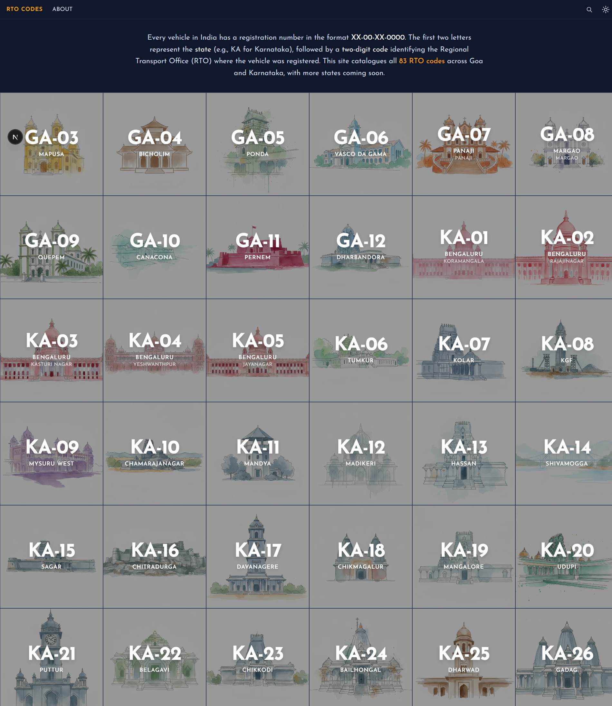
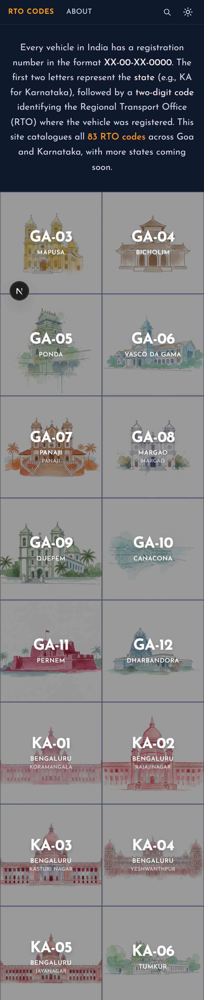
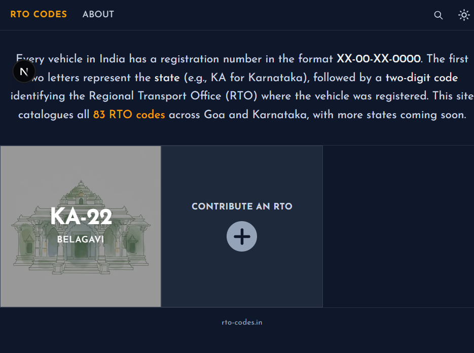

# RTO Codes India

[](https://vercel.com/new/clone?repository-url=https%3A%2F%2Fgithub.com%2Fanoopt%2Frto-codes)
[](https://rto-codes.in)

A comprehensive, searchable database of RTO (Regional Transport Office) codes in India, starting with Karnataka.

🌐 **Live Site**: [https://rto-codes.in](https://rto-codes.in)

Inspired by [airport-codes](https://github.com/lynnandtonic/airport-codes).

## 🖼️ Screenshots

<table>
  <tr>
    <td width="70%"></td>
    <td width="30%"></td>
  </tr>
  <tr>
    <td colspan="2" align="center"><em>Home page with RTO grid (desktop & mobile)</em></td>
  </tr>
</table>

<table>
  <tr>
    <td width="50%"></td>
    <td width="50%"></td>
  </tr>
  <tr>
    <td align="center"><em>Instant search functionality</em></td>
    <td align="center"><em>RTO detail with district map</em></td>
  </tr>
</table>

## 📋 Project Status

✅ **Karnataka Complete** - All 70 RTO codes documented and searchable!

**Features:**

- 🔍 Instant search by code, region, city, or district
- 📱 Fully responsive design
- 🗺️ District map highlighting (optional)
- ⚡ Static site generation for fast loading
- 🎨 Dark theme UI

### Quick Links

- **[PLANNING.md](./PLANNING.md)** - Comprehensive planning and roadmap

## 🎯 Goals

1. **Phase 1**: Create a comprehensive, searchable database of Karnataka RTO codes
2. **Future**: Expand to other Indian states
3. **Provide**: Easy-to-use interface for looking up RTO codes and their regions

## 🛠 Planned Technology Stack

- **Framework**: Next.js 15+ (React with TypeScript)
- **Styling**: Tailwind CSS
- **Search**: Fuse.js for fuzzy search
- **Deployment**: Vercel or GitHub Pages
- **Data**: JSON files with TypeScript types

## 🤝 Contributing

We welcome contributions! Whether you're adding RTO data, contributing SVG maps, or improving code, your help is appreciated.

### Quick Start

**For Non-Technical Users:**

- Submit RTO data via our [issue templates](../../issues/new/choose)

**For Developers:**

- Read our comprehensive [**CONTRIBUTING.md**](./CONTRIBUTING.md) guide
- Follow our [data standards](./CONTRIBUTING.md#data-standards) for RTO information
- Check out [development setup](./CONTRIBUTING.md#development-setup) instructions

### Ways to Contribute

1. 📝 **Add/Fix RTO Data** - Contribute JSON files for RTOs (see [CONTRIBUTING.md](./CONTRIBUTING.md#contributing-rto-data))
2. 🗺️ **Create SVG Maps** - Design state maps for visualization (see [CONTRIBUTING.md](./CONTRIBUTING.md#contributing-svg-maps))
3. 🐛 **Report Bugs** - Use our [Bug Report](../../issues/new?template=bug-report.md) template
4. ✨ **Suggest Features** - Use our [Feature Request](../../issues/new?template=feature-request.md) template
5. 📚 **Improve Documentation** - Help make our docs better

### Issue Templates

- **[Add New RTO](../../issues/new?template=add-new-rto.md)** - Suggest a missing RTO
- **[Fix RTO Data](../../issues/new?template=fix-rto-data.md)** - Report incorrect information
- **[Bug Report](../../issues/new?template=bug-report.md)** - Report website issues
- **[Feature Request](../../issues/new?template=feature-request.md)** - Suggest improvements

For detailed contribution guidelines, please see [**CONTRIBUTING.md**](./CONTRIBUTING.md).

## 🚀 Development

### Quick Start with Bun (Recommended - 10-25x Faster!)

This project uses **Bun** for maximum performance.

```bash
# Install Bun (if not already installed)
curl -fsSL https://bun.sh/install | bash
source ~/.bash_profile  # or restart terminal

# Install dependencies
bun install

# Start development server
bun run dev

# Build for production
bun run build
```

Visit `http://localhost:3000` to see the site.

### Alternative: Using npm

```bash
npm install
npm run dev
```

### Environment Variables

Create a `.env.local` file (optional but recommended):

```bash
# Recommended: Cloudinary cloud name for RTO images
# Without this, the app works but images won't display
NEXT_PUBLIC_CLOUDINARY_CLOUD_NAME=dfqx29jae

# Optional: Enable district map highlighting on RTO detail pages
NEXT_PUBLIC_ENABLE_DISTRICT_MAP=true
```

> **Note**: The Cloudinary cloud name is a public identifier for fetching images. It's safe to use for development.

### Using GitHub Codespaces

See **[QUICKSTART.md](./QUICKSTART.md)** for zero-setup cloud development with Codespaces.

## 🚀 Deployment

This site is deployed on **Vercel** with automatic deployments from the `main` branch.

### Deploy Your Own

1. Fork this repository
2. Import to [Vercel](https://vercel.com/new)
3. Add environment variable: `NEXT_PUBLIC_ENABLE_DISTRICT_MAP=true`
4. Deploy!

[](https://vercel.com/new/clone?repository-url=https%3A%2F%2Fgithub.com%2Fanoopt%2Frto-codes&env=NEXT_PUBLIC_ENABLE_DISTRICT_MAP&envDescription=Enable%20district%20map%20feature&envLink=https%3A%2F%2Fgithub.com%2Fanoopt%2Frto-codes%23environment-variables)

## 📝 License

MIT License - see [LICENSE](./LICENSE) for details.

## 🙏 Acknowledgments

- Inspired by [airport-codes](https://github.com/lynnandtonic/airport-codes) by Lynn Fisher
- RTO data sources: [Karnataka Transport Department](https://etc.karnataka.gov.in/), Wikipedia
- Built with [Next.js](https://nextjs.org/), [Tailwind CSS](https://tailwindcss.com/), [Bun](https://bun.sh/)

---

**Made with ❤️ by [Anoop T](https://github.com/anoopt)**
