# Community Contribution Workflow

This document explains how community contributions (Pull Requests) are processed through the automated validation pipeline.

## Overview

When community members contribute RTO data via Pull Requests, several automated workflows validate, enrich, and process their contributions.

```mermaid
flowchart TD
    subgraph Community["👥 Community Contribution"]
        A[Contributor forks repo] --> B[Adds/edits RTO JSON files]
        B --> C[Opens Pull Request]
    end

    subgraph Validation["🔍 PR Validation"]
        C --> D[validate-pr.yml triggers]
        D --> E{JSON valid?}
        E -->|No| F[❌ Check fails]
        F --> G[Contributor fixes issues]
        G --> D
        E -->|Yes| H{Required fields?}
        H -->|No| F
        H -->|Yes| I[✅ Validation passes]
    end

    subgraph Review["👀 Review Process"]
        I --> J[Maintainer reviews PR]
        J --> K{Approved?}
        K -->|No| L[Request changes]
        L --> G
        K -->|Yes| M[Merge to main]
    end

    subgraph PostMerge["🔄 Post-Merge Automation"]
        M --> N[post-merge.yml triggers]
        N --> O[Regenerate index.json]
        O --> P[Generate Cloudinary images]
        P --> Q[Commit updates]
        Q --> R[auto-complete-state.yml]
        R --> S{State complete?}
        S -->|Yes| T[Mark isComplete: true]
        S -->|No| U[Done]
    end
```



## Workflow Triggers

### 1. validate-pr.yml

**Triggers on:** Pull Request opened, synchronized, or reopened

```yaml
on:
  pull_request:
    types: [opened, synchronize, reopened]
    paths:
      - "data/**/*.json"
```

**What it does:**

- Validates JSON syntax
- Checks required fields (code, region, city, state, stateCode, district)
- Verifies state code format
- Ensures data consistency

### 2. post-merge.yml

**Triggers on:** Push to main branch with data changes

```yaml
on:
  push:
    branches: [main]
    paths:
      - "data/**/*.json"
```

**What it does:**

- Regenerates `data/index.json` and state index files
- Generates Cloudinary images for new RTOs
- Updates `data/rto-images.json`

### 3. auto-complete-state.yml

**Triggers on:** Completion of post-merge workflow

```yaml
on:
  workflow_run:
    workflows: ["Post-Merge Processing"]
    types: [completed]
```

**What it does:**

- Checks if state has all RTOs (count matches `totalRTOs` in config)
- Sets `isComplete: true` in state's config.json
- Commits the update

## Validation Checks

```mermaid
flowchart LR
    subgraph Checks["Validation Pipeline"]
        A[JSON Syntax] --> B[Required Fields]
        B --> C[State Code Match]
        C --> D[District Exists]
        D --> E[Status Valid]
    end

    A -->|Invalid| F[❌ Fail]
    B -->|Missing| F
    C -->|Mismatch| F
    D -->|Unknown| G[⚠️ Warning]
    E -->|Invalid| F
    E -->|Valid| H[✅ Pass]
```



### Required Fields

Every RTO JSON file must include:

| Field       | Description        | Example             |
| ----------- | ------------------ | ------------------- |
| `code`      | RTO code           | `"KA-01"`           |
| `region`    | Area/locality name | `"Koramangala"`     |
| `city`      | City name          | `"Bengaluru"`       |
| `state`     | Full state name    | `"Karnataka"`       |
| `stateCode` | 2-letter code      | `"KA"`              |
| `district`  | District name      | `"Bengaluru Urban"` |

### Optional Fields

| Field               | Description                                     |
| ------------------- | ----------------------------------------------- |
| `status`            | `"active"`, `"not-in-use"`, or `"discontinued"` |
| `established`       | Year established                                |
| `address`           | Physical address                                |
| `phone`             | Contact number                                  |
| `email`             | Official email                                  |
| `jurisdictionAreas` | Array of areas served                           |

## Contributing Steps

### 1. Fork and Clone

```bash
# Fork via GitHub UI, then:
git clone https://github.com/YOUR-USERNAME/rto-codes.git
cd rto-codes
bun install
```

### 2. Add RTO Data

```bash
# Create new RTO file
# Example: data/kerala/kl-15.json
```

```json
{
  "code": "KL-15",
  "region": "Pathanamthitta",
  "city": "Pathanamthitta",
  "state": "Kerala",
  "stateCode": "KL",
  "district": "Pathanamthitta",
  "status": "active"
}
```

### 3. Validate Locally

```bash
bun scripts/validate-rto-data.ts kerala
```

### 4. Create Pull Request

```bash
git add data/kerala/kl-15.json
git commit -m "Add KL-15 Pathanamthitta RTO"
git push origin main
# Create PR via GitHub UI
```

## PR Review Checklist

Maintainers verify:

- [ ] JSON is valid and follows schema
- [ ] RTO code matches filename (`kl-15.json` → `"code": "KL-15"`)
- [ ] State code matches folder (`kerala/` → `"stateCode": "KL"`)
- [ ] Data is accurate (cross-reference official sources)
- [ ] No duplicate entries

## After Merge

Once your PR is merged:

1. **Automatic index update** - Your RTO appears in search
2. **Image generation** - Cloudinary image created within minutes
3. **State completion check** - If you added the last RTO, state marked complete

## Troubleshooting

| Issue                       | Solution                                                          |
| --------------------------- | ----------------------------------------------------------------- |
| Validation fails            | Check JSON syntax with `bun scripts/validate-rto-data.ts <state>` |
| PR not triggering workflows | Ensure changes are in `data/**/*.json` paths                      |
| Images not appearing        | Wait ~5 mins for post-merge workflow                              |
| State not marked complete   | Check if `totalRTOs` in config.json is correct                    |

## Related Documentation

- [CONTRIBUTING.md](CONTRIBUTING.md) - General contribution guidelines
- [DATA.md](DATA.md) - Detailed data format specification
- [AUTOMATION.md](AUTOMATION.md) - Automated workflows overview
