# Project Structure Guide

This document explains the organization of the codebase, focusing on the data architecture and automation scripts.

## 📊 Data Architecture Overview

```mermaid
flowchart TB
    subgraph Sources ["📁 Source Files"]
        RTO1["ka-01.json"]
        RTO2["ka-02.json"]
        RTO3["ka-03.json"]
        RTON["..."]
        CONFIG["config.json<br/><i>stateCode, totalRTOs,<br/>districtMapping</i>"]
    end

    subgraph Scripts ["⚙️ Build Scripts"]
        GEN["generate-index.ts"]
    end

    subgraph Generated ["📦 Generated Files"]
        INDEX["index.json<br/><i>(aggregated data)</i>"]
    end

    subgraph App ["🌐 Next.js Build"]
        LISTING["Listing Pages<br/><i>Reads index.json</i>"]
        DETAIL["Detail Pages<br/><i>Reads xx-yy.json</i>"]
        MAP["District Maps<br/><i>Reads config.json</i>"]
    end

    RTO1 & RTO2 & RTO3 & RTON --> GEN
    GEN --> INDEX
    INDEX --> LISTING
    RTO1 & RTO2 & RTO3 & RTON --> DETAIL
    CONFIG --> MAP
```



---

## 📂 `../data/` Directory

The `../data/` directory is the single source of truth for the application. It follows a specific hierarchical structure essential for the static site generation process.

### Root Files

| File              | Description                                                                                                                                    |
| ----------------- | ---------------------------------------------------------------------------------------------------------------------------------------------- |
| `index.json`      | **AUTO-GENERATED.** The master registry of all RTO codes across all states. Generated by `../scripts/generate-index.ts`. Do not edit manually. |
| `rto-images.json` | **AUTO-GENERATED.** Maps RTO codes to their Cloudinary public IDs for OpenGraph images. Generated by `../scripts/generate-rto-images.ts`.      |

### State Directories (e.g., `../data/karnataka/`)

Each state or union territory has its own folder containing specific configuration and data.

| File          | Type          | Description                                                                                     |
| ------------- | ------------- | ----------------------------------------------------------------------------------------------- |
| `config.json` | **Config**    | State metadata: `stateCode`, `totalRTOs`, `isComplete`, `districtMapping` for interactive maps. |
| `index.json`  | **Generated** | **AUTO-GENERATED.** Aggregated list of all RTOs in this state. Optimized for listing pages.     |
| `map.svg`     | **Asset**     | (Optional) SVG map with district paths matching IDs in `config.json`.                           |
| `xx-yy.json`  | **Data**      | Individual RTO files (e.g., `ka-01.json`). **This is where contributors add data.**             |
| `README.md`   | **Doc**       | State-specific notes or progress tracking.                                                      |

---

## 🔑 Understanding Key Files

### `config.json` — State Metadata

The `config.json` file stores **static metadata about a state** that doesn't change frequently. It is NOT auto-generated and should be manually curated.

```json
{
  "stateCode": "KA",
  "name": "karnataka",
  "displayName": "Karnataka",
  "capital": "Bengaluru",
  "totalRTOs": 68,
  "isComplete": true,
  "type": "state",
  "mapFile": "map.svg",
  "districtMapping": {
    "Bengaluru Urban": "bangalore-urban",
    "Mysuru": "mysore"
  },
  "svgDistrictIds": ["bangalore-urban", "mysore", "..."]
}
```

**Used by:**

- `lib/state-config.ts` — Functions like `getStateConfig()`, `getStateConfigByCode()`
- `components/DistrictMap.tsx` — Maps district names to SVG element IDs for highlighting
- `scripts/verify-total-rtos.ts` — Validates file count against `totalRTOs`
- `scripts/populate-rto-data.ts` — Uses `totalRTOs` to know how many RTOs to generate

**Key fields:**
| Field | Purpose |
| ----------------- | ----------------------------------------------------------------------- |
| `stateCode` | 2-letter code (e.g., "KA", "AP") used in RTO codes |
| `totalRTOs` | Expected number of RTOs; used for validation and progress tracking |
| `isComplete` | Whether all RTOs have been added; controls UI badges |
| `districtMapping` | Maps district names → SVG path IDs for interactive map highlighting |
| `svgDistrictIds` | List of valid SVG path IDs present in `map.svg` |
| `type` | "state" or "union-territory" |

---

### `index.json` — Aggregated RTO Data (Performance Optimization)

The `index.json` files (both root and state-level) are **auto-generated performance caches**. They aggregate data from individual RTO files so the app doesn't need to read hundreds of files for listing pages.

**Why do we need this?**

```mermaid
flowchart LR
    subgraph Without ["❌ WITHOUT index.json"]
        direction TB
        H1["Home Page"] --> R1["Read ka-01.json"]
        R1 --> R2["Read ka-02.json"]
        R2 --> R3["Read ka-03.json"]
        R3 --> R4["... 400+ files"]
        R4 --> SLOW["🐌 Slow!"]
    end

    subgraph With ["✅ WITH index.json"]
        direction TB
        H2["Home Page"] --> IDX["Read index.json"]
        IDX --> FAST["⚡ Done!"]
    end
```



**Generated by:** `bun scripts/generate-index.ts`

**Contains:** Summarized RTO data (code, region, city, state, stateCode, district, status, redirectTo) — enough for search and listing, but not full details like address or phone.

**Used by:**

- `lib/rto-data.ts` — `getAllRTOs()` reads the master index for home page listing
- `components/SearchableRTOs.tsx` — Client-side search uses pre-aggregated data
- `app/rto/[code]/page.tsx` — `generateStaticParams()` reads index for static generation

---

### Individual RTO Files (`xx-yy.json`) — Full Data

These are the **source of truth** for each RTO. They contain complete information:

```json
{
  "code": "KA-01",
  "region": "Koramangala",
  "city": "Bengaluru",
  "state": "Karnataka",
  "stateCode": "KA",
  "district": "Bengaluru Urban",
  "status": "active",
  "established": "1988",
  "address": "80 Feet Road, Koramangala",
  "pinCode": "560034",
  "phone": "080-25520763",
  "email": "rto-blr@karnataka.gov.in",
  "jurisdictionAreas": ["Koramangala", "Indiranagar", "..."],
  "isDistrictHeadquarter": true
}
```

**Used by:**

- Detail pages (`app/rto/[code]/page.tsx`) — Reads full file for complete information
- Validation scripts — Check data integrity
- Image generation — Uses city/region for AI-generated images

---

### Data Flow Summary

```mermaid
flowchart LR
    subgraph Contributors ["👥 Contributors"]
        EDIT1["Edit xx-yy.json"]
        EDIT2["Edit config.json"]
    end

    subgraph Scripts ["⚙️ Build Scripts"]
        GEN["generate-index"]
        VAL["validate-rto"]
        SITE["generate-sitemap"]
    end

    subgraph App ["🌐 Application"]
        LIST["Reads index.json<br/>for listings"]
        DETAIL["Reads xx-yy.json<br/>for detail pages"]
    end

    EDIT1 --> GEN & VAL
    EDIT2 --> GEN
    GEN --> LIST
    EDIT1 --> DETAIL
    VAL --> SITE
```



---

## 📁 Why Separate Files?

We use one file per RTO (e.g., `ka-01.json`, `ka-02.json`) instead of one giant JSON file to:

1.  **Reduce Merge Conflicts**: Multiple contributors can add different RTOs simultaneously without conflict.
2.  **Cleaner Diffs**: Pull requests are easier to review.
3.  **Granular Validation**: We can validate files individually.
4.  **Selective Updates**: Scripts can update specific RTOs without touching others.

---

## 📜 `../scripts/` Directory

This project relies heavily on automation scripts to maintain data integrity and generate performance optimizations. **Always run these with `bun`.**

### 🟢 Core & Build Scripts

These run automatically during `bun run build` (via `prebuild` script).

| Script                | Command                           | Purpose                                                                                                      |
| --------------------- | --------------------------------- | ------------------------------------------------------------------------------------------------------------ |
| `generate-index.ts`   | `bun scripts/generate-index.ts`   | **Critical.** Generates all `index.json` files from individual RTO files. Must run after adding any new RTO. |
| `generate-sitemap.ts` | `bun scripts/generate-sitemap.ts` | Generates `public/sitemap.xml` for SEO.                                                                      |

### 🟡 Validation & Quality

Tools for contributors to check their work.

| Script                         | Usage                                                             | Purpose                                                      |
| ------------------------------ | ----------------------------------------------------------------- | ------------------------------------------------------------ |
| `validate-rto-data.ts`         | `bun scripts/validate-rto-data.ts <state> [code]`                 | Validates JSON structure; optionally uses AI.                |
| `validate-and-fix-rto-data.ts` | `bun scripts/validate-and-fix-rto-data.ts <state> --fix --search` | Validates and auto-fixes data using Google Search grounding. |
| `verify-total-rtos.ts`         | `bun scripts/verify-total-rtos.ts`                                | Checks file count against `config.json` `totalRTOs`.         |
| `fix-rto-data.ts`              | `bun scripts/fix-rto-data.ts <state>`                             | Fixes common formatting issues (whitespace, caps).           |

### 🔴 Maintainer-Only Scripts

Scripts that require API keys or are used for bulk operations.

| Script                   | Usage                                        | Purpose                                                            |
| ------------------------ | -------------------------------------------- | ------------------------------------------------------------------ |
| `populate-rto-data.ts`   | `bun scripts/populate-rto-data.ts <state>`   | Uses Gemini AI to generate RTO files. **Skips `not-in-use` RTOs.** |
| `generate-rto-images.ts` | `bun scripts/generate-rto-images.ts <state>` | Generates OG images via Gemini + Cloudinary.                       |
| `fetch-rto-data.ts`      | `bun scripts/fetch-rto-data.ts`              | Scrapes raw RTO data from external sources.                        |
| `generate-icons.ts`      | `bun scripts/generate-icons.ts`              | Generates PWA icons from master SVG.                               |

> **Note on `populate-rto-data.ts`**: This script reads `config.json` to determine how many RTOs to generate (`totalRTOs`). It intentionally skips creating files for RTOs that should have `status: "not-in-use"` — those must be manually curated for states with legacy codes (like Andhra Pradesh post-bifurcation).

---

## 🏗️ Application Directories

### `../app/` (Next.js App Router)

| Path                  | Purpose                                                               |
| --------------------- | --------------------------------------------------------------------- |
| `layout.tsx`          | Root layout with theme provider, header, footer.                      |
| `page.tsx`            | Home page — lists all RTOs using data from `index.json`.              |
| `rto/[code]/page.tsx` | Dynamic RTO detail page. Reads individual `xx-yy.json` for full data. |
| `about/page.tsx`      | Static about page.                                                    |
| `contribute/page.tsx` | Contribution guidelines page.                                         |
| `not-found.tsx`       | Custom 404 page.                                                      |

> **No API routes**: This is a fully static site. All data is read at build time, not runtime.

### `../components/`

| Component            | Purpose                                                                    |
| -------------------- | -------------------------------------------------------------------------- |
| `DistrictMap.tsx`    | SVG map rendering with district highlighting. Uses `config.json` mappings. |
| `SearchableRTOs.tsx` | Client-side search using Fuse.js over pre-loaded `index.json` data.        |
| `RTOImage.tsx`       | Displays Cloudinary-hosted RTO images using `rto-images.json`.             |
| `Header.tsx`         | Navigation header with search and theme toggle.                            |
| `ThemeProvider.tsx`  | Dark/light mode support via `next-themes`.                                 |

### `../lib/`

| File              | Purpose                                                                           |
| ----------------- | --------------------------------------------------------------------------------- |
| `rto-data.ts`     | Server-side data fetching: `getAllRTOs()`, `getRTOByCode()`, `getAdjacentRTOs()`. |
| `state-config.ts` | State configuration helpers: `getStateConfig()`, `getSvgDistrictId()`.            |
| `cloudinary.ts`   | Cloudinary URL generation for RTO images.                                         |
| `map-server.ts`   | Server-side SVG map loading and processing.                                       |

### `../types/`

| File              | Purpose                                                        |
| ----------------- | -------------------------------------------------------------- |
| `rto.ts`          | `RTOCode` interface — the main data structure for RTO entries. |
| `state-config.ts` | `StateConfig` interface for `config.json` files.               |

---

## 🔄 Common Workflows

### Adding a New RTO

```bash
# 1. Create the RTO file
echo '{"code": "KA-99", "region": "...", ...}' > data/karnataka/ka-99.json

# 2. Validate the data
bun scripts/validate-rto-data.ts karnataka ka-99

# 3. Regenerate index (or let prebuild do it)
bun scripts/generate-index.ts

# 4. Test locally
bun run dev
```

### Adding a New State

```bash
# 1. Create state folder with config.json
mkdir data/new-state
# Add config.json with stateCode, name, totalRTOs, etc.

# 2. Use AI to populate RTOs (maintainers only)
bun scripts/populate-rto-data.ts new-state

# 3. Validate all data
bun scripts/validate-rto-data.ts new-state

# 4. Generate images (maintainers only)
bun scripts/generate-rto-images.ts new-state
```

### Handling Legacy/Inactive RTOs

For states with reorganized RTO codes (like Andhra Pradesh after Telangana bifurcation):

```json
{
  "code": "AP-02",
  "region": "Anantapur (Old Code)",
  "status": "not-in-use",
  "redirectTo": "AP-39",
  "note": "Legacy code. Use AP-39 (unified state code) for new registrations."
}
```

> **Important**: The `populate-rto-data.ts` script skips `not-in-use` RTOs. These must be manually created.
